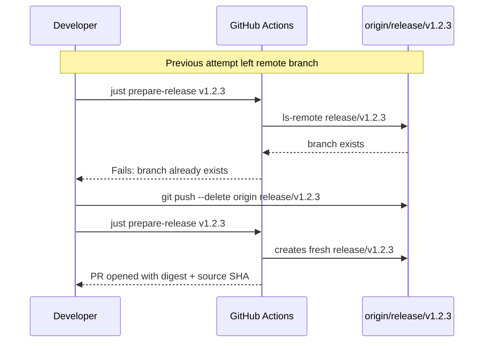

# Release workflow troubleshooting memo

## If `prepare-release vX.Y.Z` fails

### Option 1: Fix the underlying issue and re-run

Use this when the failure is caused by something fixable in the repository — for
example, a missing `CHANGELOG.md` entry, a workflow bug, or a transient CI issue.

#### Example: stale `release/v1.2.3` branch after a previous failed prepare

You trigger `just prepare-release v1.2.3` and the job fails at *Prepare release branch*
with:

```text
Error: branch release/v1.2.3 already exists on origin.
```

This happens when the same version was prepared earlier and the branch was left on
the remote (for example, when a release was put on hold after security feedback).



Recovery steps:

1. Fix the underlying problem and commit it (e.g., re-add CHANGELOG entry, apply security fixes).
2. Delete the stale remote branch:
   ```bash
   git push origin --delete release/v1.2.3
   ```
3. Re-run the preparation workflow:
   ```bash
   just prepare-release v1.2.3
   ```

#### Generic steps

1. Fix the problem and commit it.
2. Delete the stale `release/vX.Y.Z` branch if it was created:
   ```bash
   git push origin --delete release/vX.Y.Z
   ```
3. Re-run the preparation workflow:
   ```bash
   just prepare-release vX.Y.Z
   ```

### Option 2: Increment the version

Use this when the failure happened after `SOURCE_DATE_EPOCH` was written or the
tarball build started. The deterministic digest depends on the exact source tree
and timestamp, so re-running with the same version may produce a different
digest even after the fix.

The cleanest path is to bump to a new version:

```bash
just prepare-release vX.Y.Z+1
```

For example, a failed `v1.2.3` becomes `v1.2.4`.

## Important: never reuse a tag

Git tags are meant to be immutable. If `vX.Y.Z` was already pushed and the
release is broken, do **not** force-push the tag. Release `vX.Y.Z+1` instead.

## If the PR was already opened but is wrong

1. Close the PR on GitHub.
2. Delete the branch:
   ```bash
   git push origin --delete release/vX.Y.Z
   ```
3. Fix the issue.
4. Either re-run `just prepare-release vX.Y.Z` or bump to a new version.
