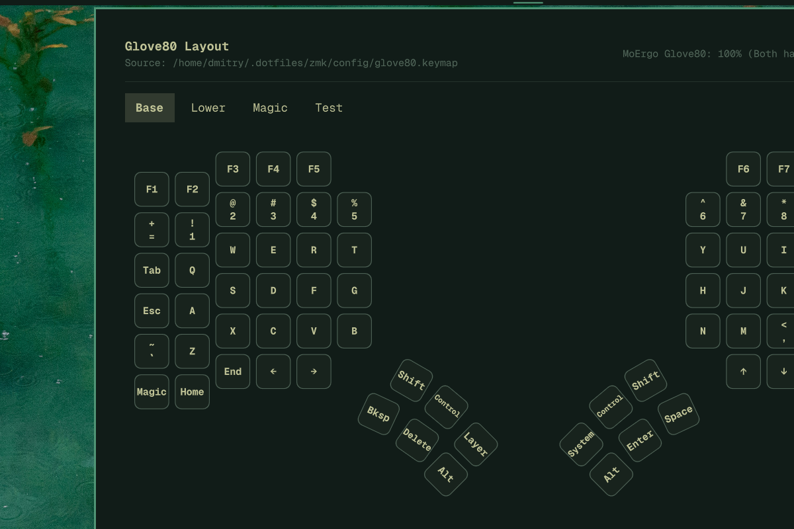
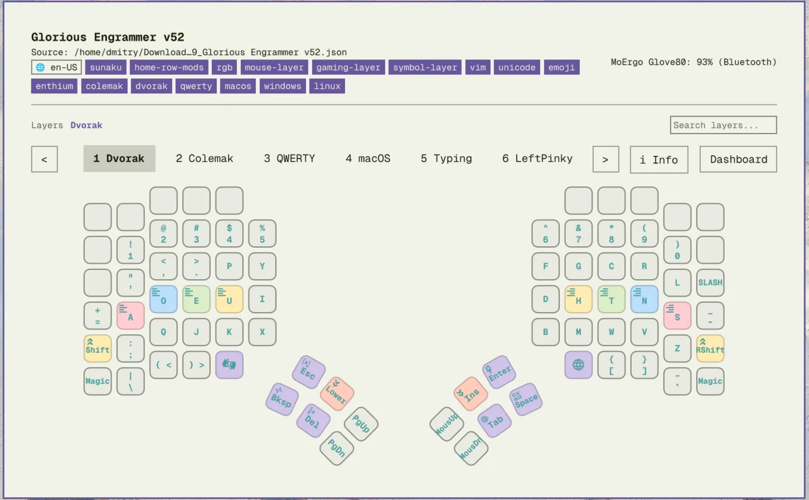

# Omarchy MoErgo Companion

An [Omarchy](https://github.com/omacom/omarchy) plugin that visualizes MoErgo Glove80 keymap layers in the bar panel and monitors hardware status in real time.

Shown with the **Glorious Engrammer** keymap from [sunaku/glove80-keymaps](https://github.com/sunaku/glove80-keymaps), and the [Outpost](https://github.com/simoz/omarchy-outpost-theme) (dark) and [Pissarro](https://github.com/mattbbia/pissarro) (light) Omarchy themes:




The plugin inherits the active Omarchy theme colors automatically.

## Installation

### Via the Omarchy plugin installer (recommended)

```bash
omarchy plugin add https://github.com/dphov/omarchy-moergo-companion.git --enable
omarchy-restart-shell
```

The plugin automatically downloads verified native helpers from the matching GitHub release on first run. If no release exists or the platform is unsupported, it builds the helpers from source. No manual steps are required.

### Manual install / rebuild

For users who want to run the install script manually (e.g., after `omarchy plugin add` or in a standalone clone):

```bash
~/.config/omarchy/plugins/dphov.omarchy-moergo-companion/install.sh
# or, from a standalone clone:
./install.sh --rebuild
```

`./install.sh --rebuild` is a self-contained script that compiles all native helpers from locked dependencies (`keymap-parser/Cargo.lock`) and deploys to `~/.config/omarchy/plugins/dphov.omarchy-moergo-companion/`. Without `--rebuild`, it first checks for Linux x86_64, then downloads the matching release tarball, verifies it against the top-level `SHA256SUMS`, extracts it, and verifies the binaries against the internal `bin/SHA256SUMS`.
## Usage

Click the Glove80 bar item to open the panel. Inside the panel you can:

- Browse layers with the tab row, search field, or keyboard shortcuts.
- Hover keys to see behavior descriptions and layer-switch hints.
- Press `1`–`9` to jump to a layer, `Tab`/`Shift+Tab` or arrow keys to cycle, and `D` or `C` to toggle the dashboard.
- Open the dashboard to see battery, USB/Bluetooth transport state, and BLE controls.
- Change the keymap file path in the dashboard; the new path is validated and persisted to `~/.config/omarchy/glove80-plugin-settings.json`.

## Features

- **Hardware status in the bar** — live battery, USB/Bluetooth transport, and charging state for the Glove80 left/right halves.
- **Interactive layer visualizer** — physical Glove80 column-stagger and thumb-cluster layout with per-key colors, glyphs, and layer names.
- **Transparent key resolution** — `&trans` keys follow the layer fall-through stack so you see the real binding from the base layer.
- **Smart tooltips** — hover a key with a description, layer switch, sticky modifier, or special behavior to see its title and purpose.
- **Layer navigation** — clickable tabs, search, and keyboard shortcuts (`1`–`9`, `Tab`/`Shift+Tab`, arrow keys) to move between layers.
- **Dashboard** — device telemetry, BLE connect/disconnect/trust/forget controls, quick links, and an editable keymap path.
- **Low-battery notifications** — desktop alerts at ≤20% and ≤10% with hysteresis to avoid spam.
- **Theme-aware** — automatically inherits Omarchy colors for light and dark themes.

## Architecture

The plugin is split into a **service** and a **bar widget**, so background work runs once even when multiple widget instances exist.

```
├── manifest.json                    # Omarchy plugin registration (service + bar-widget)
├── Service.qml                        # Background service: hardware monitors, keymap watcher, settings
├── MoErgoCompanion.qml                # Bar widget: button + panel UI
├── components/
│   ├── MoErgoCompanionDashboard.qml   # Hardware control center and device status
│   ├── MoErgoCompanionLayoutInfo.qml # Layout metadata tabs (notes, behaviors, devicetree, config)
│   ├── MoErgoCompanionLayerTabs.qml   # Dynamic paginated layer selector
│   ├── Glove80Matrix.qml              # Physical key matrix positioning and geometry
│   └── KeyCap.qml                     # Keycap rendering, borders, tooltips, interaction
├── keymap-parser/                     # Rust crate
│   ├── Cargo.toml
│   ├── src/
│   │   ├── main.rs                    # CLI parser entry point
│   │   ├── lib.rs
│   │   ├── parser.rs                  # Keymap parsing orchestration
│   │   ├── reader.rs                  # File I/O and comment stripping
│   │   ├── tokenizer.rs               # Bindings tokenization
│   │   ├── behaviors.rs                 # ZMK behavior arity lookup
│   │   ├── legends.rs                   # Key legend mapping tables
│   │   ├── descriptions.rs            # Tooltip title/description tables
│   │   ├── glyphs.rs                    # SVG glyph category lookup
│   │   ├── layers.rs                    # Layer name extraction/humanization
│   │   ├── json_layout.rs               # Glove80 layout-editor JSON adapter
│   │   ├── transparency.rs              # &trans fall-through resolution
│   │   └── models.rs                    # Key/Layer data structures
│   └── tests/fixtures/                  # Golden JSON integration tests
├── install.sh                         # Downloads release helpers or builds from source, then installs the plugin
├── justfile                           # Common tasks: build, test, lint, install, restart
└── preview.png                        # Marketplace preview image
```

### Service / widget split

`Service.qml` owns all background work:

- `moergo-watcher` polls the keymap file and streams parsed layout JSON.
- `glove80-status` polls every 30 seconds for battery and transport state.
- `udevadm monitor` and `gdbus monitor` watch for USB/Bluetooth changes.
- `moergo-companion-settings` loads and persists the keymap path.
- Dashboard actions (`--connect`, `--disconnect`, `--trust`, `--untrust`, `--forget`) are sent to `glove80-status`.

`MoErgoCompanion.qml` only renders the bar button and panel, binds to the service state, and forwards user input to service methods.

### Rust binaries

| Binary | Purpose |
|--------|---------|
| `omarchy-moergo-keymap-parser` | Parse a `.keymap` or Glove80 layout-editor `.json` file and print the resolved layout as JSON. |
| `moergo-watcher` | Watch a keymap/JSON file and emit the latest layout JSON on stdout whenever the file changes. |
| `glove80-status` | Read USB/Bluetooth/battery state and execute BLE connect/disconnect/trust/forget actions. |
| `moergo-companion-settings` | Load, get, or set plugin settings with keymap path validation. |

## Security & Binary Provenance

To prevent supply chain risks, symlink attacks, and untrusted local binaries:

1. **No committed binaries**: Native helpers are never committed to the source tree. They are built, attested, and distributed exclusively as GitHub release assets.
2. **Sole verified builder (GitHub Actions)**: Native helpers are compiled exclusively by GitHub Actions in a clean, isolated container directly from reviewed source code and locked dependencies (`keymap-parser/Cargo.lock`).
3. **Immutable supply chain**: Every third-party action, the Rust toolchain, and the `install.sh` source sync exclude list use reviewed immutable identifiers. All mutable action tags and branch refs have been replaced with full commit SHAs, and workflow permissions are set at the job level with least privilege.
4. **Verifiable signed provenance**: Each release produces a GitHub artifact attestation (`actions/attest-build-provenance`) that cryptographically ties the exact released binary hashes to the reviewed locked source and the specific GitHub Actions run. Release notes include `gh attestation verify` instructions.
5. **User-private runtime directory**: Runtime state (`glove80_layout.json`, `glove80_watcher.pid`, `glove80_battery_notified.json`) is stored in `$XDG_RUNTIME_DIR/omarchy-moergo-companion` with a mode-`0700` fallback (`/tmp/omarchy-moergo-$UID`).
6. **Symlink defense & safe PID locking**: The watcher opens PID files using `libc::O_NOFOLLOW` without premature truncation, verifies ownership, and acquires an exclusive `flock` before writing.
7. **Atomic file replacement**: State and layout files are written to mode-`0600` temporary files within the private runtime directory and atomically renamed to prevent partial reads or symlink injection.

To verify binaries:

```bash
# Verify the tarball against the top-level release manifest
sha256sum -c SHA256SUMS

# Extract into bin/ and verify the binaries against the internal manifest
mkdir -p bin
tar -xzf omarchy-moergo-companion-binaries-v1.1.5.tar.gz -C bin
sha256sum -c bin/SHA256SUMS

# Verify signed build provenance for the tarball (requires GitHub CLI)
gh attestation verify --owner dphov --predicate-type https://slsa.dev/provenance/v1 omarchy-moergo-companion-binaries-v1.1.5.tar.gz
```

## Development

For developers contributing or iterating on the plugin, a `justfile` provides daily workflow commands:

```bash
just install          # Compile native helpers and install to ~/.config/omarchy/plugins/
just reload           # Build, install, and restart the Omarchy shell (full reload)
just build            # Compile release binaries locally into bin/ and generate SHA256SUMS
just sha              # Compute and display SHA-256 checksums of bin/
just verify-sha       # Verify binary integrity against bin/SHA256SUMS
just test             # Run all Rust unit, integration, and security tests
just lint             # Validate QML syntax across all files with qmllint
just dev              # Live-reload development mode using cargo-watch
just clean            # Remove Rust build artifacts
just release <tag>    # Verify clean git state, run test & lint, tag, and push release
```
## Configuration

The plugin reads the keymap path from `~/.config/omarchy/glove80-plugin-settings.json`. On first run it defaults to:

```text
~/.dotfiles/zmk/config/glove80.keymap
```

Change it from the dashboard, or edit the settings file directly:

```json
{
  "keymapFile": "/path/to/your/glove80.keymap"
}
```

The file is validated before being saved. Both ZMK `.keymap` files and Glove80 layout-editor `.json` exports are supported.

## Dependencies

- [Omarchy](https://github.com/omacom/omarchy) with bar-widget support
- [Rust toolchain](https://rustup.rs/) (`cargo`) to build helper binaries
- [just](https://github.com/casey/just) for convenience tasks (optional, `install.sh` works without it)
- `upower`, BlueZ / `bluetoothctl` (hardware status and battery)
- `udevadm`, `gdbus` (hotplug monitoring)
- `zenity` (keymap file picker in the dashboard)

## Troubleshooting

- **No layers appear** — check that `keymapFile` points to a valid `.keymap` or `.json` file and that the path is saved in `~/.config/omarchy/glove80-plugin-settings.json`.
- **Old watcher still running** — `moergo-watcher` uses a PID lock in `$XDG_RUNTIME_DIR/omarchy-moergo-companion/glove80_watcher.pid` (or `/tmp/omarchy-moergo-$UID/`); kill any stale process if shell reloads leave multiple watchers running.
- **Battery shows unknown** — ensure `upower` and BlueZ are running and the Glove80 halves are paired.
- **Check shell logs** — `journalctl --user -u omarchy-shell -n 100` or `journalctl --user -n 100` for QML/Rust errors.

## Uninstall

```bash
omarchy plugin disable dphov.omarchy-moergo-companion
omarchy plugin remove dphov.omarchy-moergo-companion
omarchy-restart-shell
```

Or delete `~/.config/omarchy/plugins/dphov.omarchy-moergo-companion/` manually and restart the shell.

## Attributions

Key glyphs in `assets/key-glyphs/` are from open icon sets used under their respective licenses:

- **[Font Awesome Free](https://fontawesome.com/)** — `fa-*` glyphs. License: [CC BY 4.0](https://creativecommons.org/licenses/by/4.0/) (icons) / [SIL OFL 1.1](https://scripts.sil.org/OFL) (fonts) / MIT (code). Copyright Fonticons, Inc.
- **[Ionicons](https://ionic.io/ionicons)** — `io-finger-print` and the `system.svg` glyph. License: [MIT](https://github.com/ionic-team/ionicons/blob/main/LICENSE).
- **[Tabler Icons](https://tabler-icons.io/)** — `tb-*` glyphs and the `tap.svg` glyph. License: [MIT](https://github.com/tabler/tabler-icons/blob/main/LICENSE).
- **[Devicon](https://devicon.dev/)** — `di-linux.svg`. License: [MIT](https://github.com/devicons/devicon/blob/master/LICENSE).
