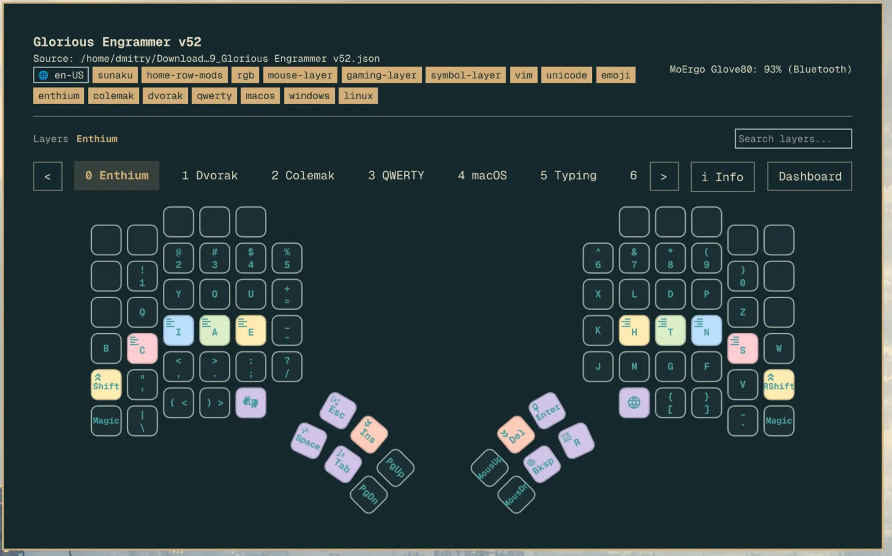

# Omarchy Moergo Companion (`dphov.omarchy-moergo-companion`)

MoErgo Glove80 visualizer and hardware status plugin for [Omarchy](https://github.com/omacom/omarchy).

## Screenshots

Shown with the **Glorious Engrammer** keymap from [sunaku/glove80-keymaps](https://github.com/sunaku/glove80-keymaps), and the [Outpost](https://github.com/simoz/omarchy-outpost-theme) (dark) and [Pissarro](https://github.com/mattbbia/pissarro) (light) Omarchy themes:




The plugin inherits the active Omarchy theme colors automatically.

## Installation

### From the Omarchy marketplace

```bash
omarchy plugin add https://github.com/dphov/omarchy-moergo-companion.git --enable
omarchy-restart-shell
```

### From source

```bash
./install.sh
omarchy-restart-shell
```

`install.sh` builds the Rust crate in release mode and places all helper
binaries (`omarchy-moergo-keymap-parser`, `moergo-watcher`, `glove80-status`,
`moergo-companion-settings`) in `bin/`. No separate `cargo` command is required.

To build the helpers manually:

```bash
cd keymap-parser
cargo build --release
```

The compiled binaries will be in `keymap-parser/target/release/`:
`omarchy-moergo-keymap-parser`, `moergo-watcher`, `glove80-status`, and
`moergo-companion-settings`.

## Features

- **Live hardware monitor**: Real-time USB connection detection for both halves (`16c0:27db` Left, `16c0:27d9` Right) + Bluetooth battery percentage via UPower/BlueZ.
- **Instant hotplug reactivity**: Monitors USB events via `udevadm monitor -s usb` with debouncing for immediate connection state updates on plug/unplug.
- **Unified bar widget**: Displays charging icon and battery level (`⚡ 96%` when wired, `96%` on battery, `Disconnected` when offline). Detailed per-half status available on hover tooltip.
- **Physical Glove80 matrix visualizer**: Authentic curved column-stagger and thumb cluster geometry.
- **Layer fall-through resolution**: Transparent (`&trans`) keys automatically resolve through the layer stack down to Base layer keys, showing exact names rather than placeholder labels.
- **Transparent key styling**: Unassigned/trans keys render with transparent fill and elegant dashed borders, while native layer keys render with solid fill and borders.
- **Interactive layer jumping**: Hovering any layer switch key (`Base`, `Lower`, `Magic`, `Test`, `Layer`) shows a tooltip and clicking jumps directly to that layer.
- **Rich keycap tooltips**: Hovering any key displays a styled floating card with its full action Title and Description (e.g. Output Selection USB, RGB controls, Bluetooth profile switching).
- **Built-in Glove80 Dashboard**: Integrated hardware control center:
  - Live device telemetry: Device Name, Bluetooth MAC address, connection transport (USB/BLE), pairing state, battery level with charging status.
  - Controls: Connect / Disconnect BLE, Trust / Untrust device (auto-reconnect), Forget device.
  - Quick Links: Glove80 Layout Editor (`my.glove80.com`), ZMK Studio (`zmk.studio`), and Moosytype trainer.
  - Editable layout source: change the ZMK keymap file path directly from the dashboard; persisted to `settings.json`.
  - Low-battery desktop notifications at $\le 20\%$ and $\le 10\%$ with hysteresis.
- **Keyboard navigation**:
  - `1` .. `4`: Jump directly to layers (Base, Lower, Magic, Test).
  - `d` (or `c`): Toggle Dashboard view.
  - `Tab` / `Shift+Tab`: Cycle forward/backward through layers.
  - `Left` / `Right` (or `h` / `l`): Navigate layer tabs.
  - `Esc`: Dismiss the panel.

## Architecture

```
├── manifest.json                   # Omarchy bar-widget plugin registration
├── MoErgoCompanion.qml             # Unified Panel: bar button + KeyboardPanel popup
├── components/
│   ├── MoErgoCompanionDashboard.qml # Hardware control center and device status
│   ├── Glove80Matrix.qml           # Physical key matrix positioning and geometry
│   ├── KeyCap.qml                  # Keycap rendering, borders, tooltips, interaction
│   └── MoErgoCompanionLayerTabs.qml # Dynamic paginated layer selector
├── keymap-parser/                  # Rust ZMK keymap and Glove80 JSON parser
│   ├── Cargo.toml
│   ├── src/
│   │   ├── main.rs                 # CLI entry point
│   │   ├── lib.rs
│   │   ├── parser.rs               # Keymap parsing orchestration
│   │   ├── reader.rs               # File I/O and comment stripping
│   │   ├── tokenizer.rs            # Bindings tokenization
│   │   ├── behaviors.rs            # ZMK behavior arity lookup
│   │   ├── legends.rs              # Key legend mapping tables
│   │   ├── descriptions.rs         # Tooltip title/description tables
│   │   ├── glyphs.rs               # SVG glyph category lookup
│   │   ├── layers.rs               # Layer name extraction/humanization
│   │   ├── json_layout.rs          # Glove80 layout-editor JSON adapter
│   │   ├── transparency.rs         # &trans fall-through resolution
│   │   └── models.rs               # Key/Layer data structures
│   └── tests/fixtures/             # Golden JSON integration tests
├── bin/
│   ├── moergo-companion-settings   # Rust plugin settings read/write helper with validation
│   ├── glove80-status              # Rust hardware monitor (USB sysfs + BlueZ/UPower)
│   ├── moergo-watcher              # Rust watcher: polls keymap/JSON file and streams layout JSON to QML
│   └── omarchy-moergo-keymap-parser # Rust native keymap parser (built by install.sh)
└── install.sh                      # Builds Rust helpers and installs plugin
```

> Note: the previous `watcher.sh` was replaced by `bin/moergo-watcher`. All helper binaries are now built from the Rust crate in `keymap-parser/`.

## Dependencies

- Omarchy with bar-widget support
- Rust toolchain (`cargo`) to build the helper binaries
- `upower`, `bluez` / `bluetoothctl` (hardware status and battery monitoring)
- A local Glove80 ZMK keymap at `~/.dotfiles/zmk/config/glove80.keymap` (or edit the keymap path in the dashboard settings)

## Removal

```bash
omarchy plugin disable dphov.omarchy-moergo-companion
omarchy plugin remove dphov.omarchy-moergo-companion
omarchy-restart-shell
```

Or, if installed manually, delete `~/.config/omarchy/plugins/dphov.omarchy-moergo-companion/` and restart the shell.
